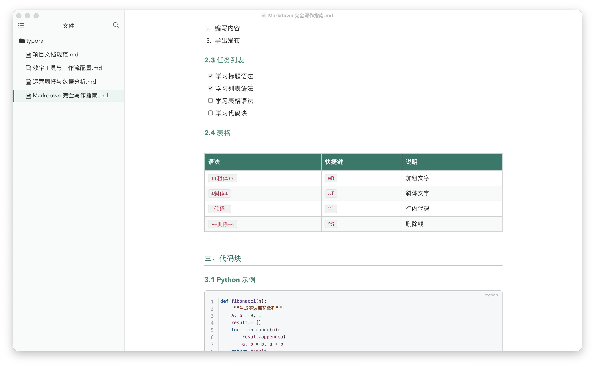
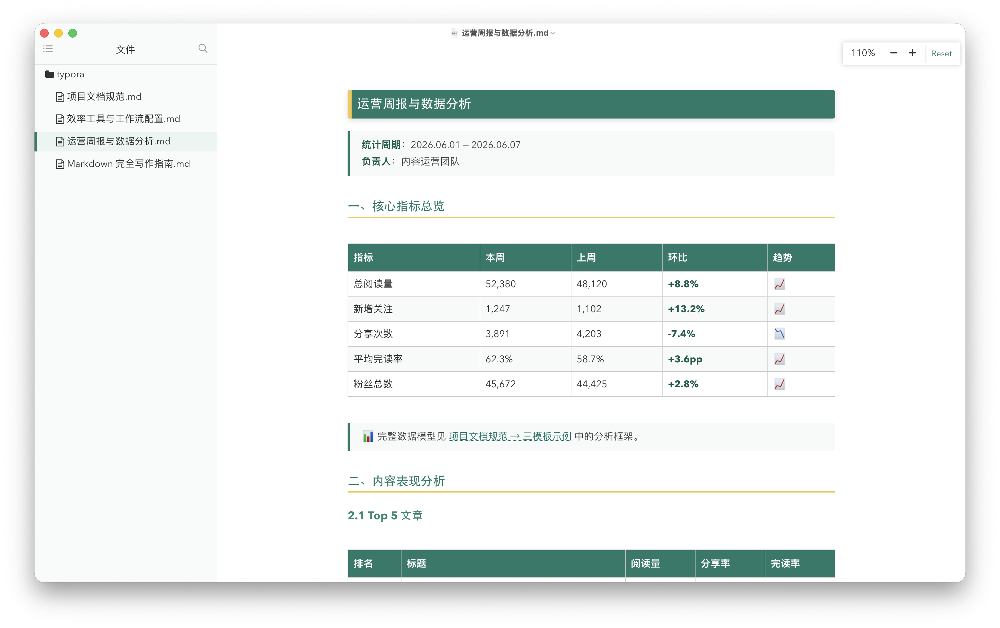
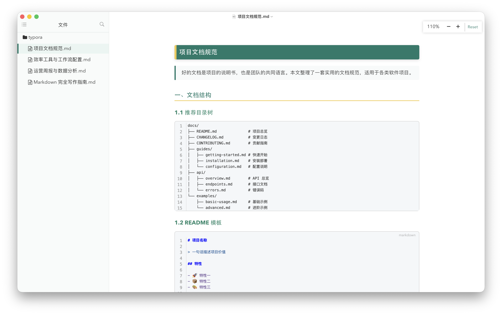
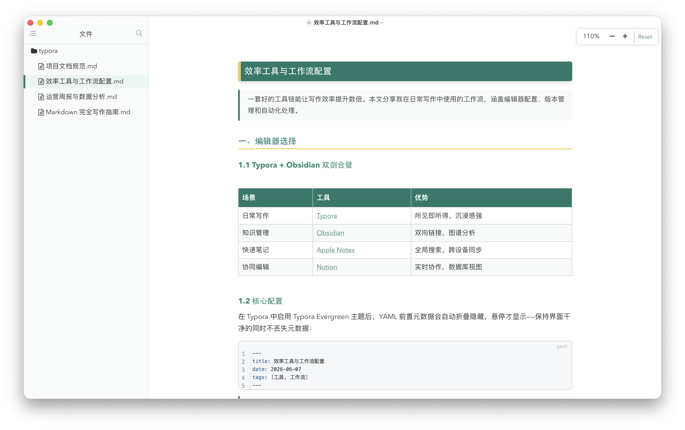

<div align="center">

# 🌿 Typora Evergreen



**A refined Typora theme for Chinese–English mixed typography, with an Obsidian link converter built in.**

[](https://github.com/tsingke/typora-evergreen)
[](https://typora.io)
[](LICENSE)

---

[Features](#-features) • [Screenshots](#-screenshots) • [Installation](#-installation) • [Usage](#-usage) • [Examples](#-examples)

</div>

---

## ✨ Features

### 🎨 Typography Optimized for Mixed Scripts

| Script | Body | Heading | Code |
|--------|------|---------|------|
| **English** | Avenir Next | Avenir Next | SF Mono |
| **中文** | PingFang SC | Heiti SC | — |
| **Fallback** | Hiragino Sans GB | STHeiti | Cascadia → Menlo |

English fonts are listed first so the browser's font fallback mechanism selects the right face for each character automatically.

### 🌓 Light / Dark / Print

- **Light mode** — clean white background with deep green accents
- **Dark mode** — follows system `prefers-color-scheme` automatically
- **Print** — switches to serif (Times New Roman + Songti SC) for paper-friendly output

### 🧹 Clean YAML Frontmatter

Metadata blocks are **collapsed by default** — hover to reveal, click to edit. Your document stays clean.

### 🔗 Obsidian Wiki‑Link Converter

Convert `[[wikilinks]]` from Obsidian vaults into standard Markdown links that work in Typora:

```
[[Note]]             →  [Note](./Note.md)
[[Note|Display]]     →  [Display](./Note.md)
[[Note#Heading]]     →  [Note → Heading](./Note.md)
![[image.png]]       →  
```

### 📦 What's Included

```
typora-evergreen/
├── theme/
│   └── typora-evergreen.css      ← The Typora theme
├── tools/
│   └── obsidian-to-typora.py     ← Wiki-link converter
└── examples/
    ├── obsidian/                 ← Example notes (Obsidian format)
    └── typora/                   ← Same notes (converted for Typora)
```

---

## 📸 Screenshots

> All screenshots are taken with the theme applied. Click to enlarge.

### Full Document


### Data Report (Tables, Code Blocks, Task Lists)



### Document Specification (Mermaid Diagrams, Blockquotes)



### Tools & Workflow (Tables, Code, Shortcuts)



---

## 🚀 Installation

### macOS

1. **Install the theme**

   ```bash
   # Typora → Preferences → Appearance → Open Theme Folder
   cp theme/typora-evergreen.css ~/Library/Application\ Support/abnerworks.Typora/themes/
   ```

2. **Restart Typora**, then select the theme from the menu:  
   `Typora → Themes → Typora Evergreen`

3. **(Optional) Install the converter**

   ```bash
   pip install pathlib    # if needed (Python 3.x only)
   cp tools/obsidian-to-typora.py ~/Desktop/
   ```

### Windows

1. **Install the theme**

   ```bash
   # File → Preferences → Appearance → Open Theme Folder
   copy theme\typora-evergreen.css %APPDATA%\Typora\themes\
   ```

2. **Restart Typora**, then: `Typora → Themes → Typora Evergreen`

3. **(Optional) Font notes for Windows**

   For the best Chinese–English mixed typography experience, consider installing:
   - **Avenir Next** — available via [Adobe Fonts](https://fonts.adobe.com) (free with CC account)
   - **PingFang SC** — bundled with macOS only; on Windows, the fallback chain uses Microsoft YaHei automatically

   The theme's font stack gracefully degrades on Windows:
   ```css
   /* macOS */   Avenir Next → PingFang SC → ...
   /* Windows */  Avenir Next → Microsoft YaHei → ...
   ```

4. **(Optional) Install the converter**

   ```bash
   python obsidian-to-typora.py input.md output.md
   ```

---

## 🔧 Usage

### Converting Obsidian Notes for Typora

```bash
# Single file
python3 obsidian-to-typora.py my-note.md note-for-typora.md

# Entire vault (creates a copy – original is untouched)
python3 obsidian-to-typora.py ~/obsidian-vault ~/Desktop/for-typora
```

The converted files use standard Markdown links (`[text](./file.md)`).  
**⌘+Click** (macOS) or **Ctrl+Click** (Windows) to follow them inside Typora.

### Navigating Back

| Action | macOS | Windows |
|--------|-------|---------|
| Go back | `⌘[` | `Ctrl+Alt+Left` |
| Go forward | `⌘]` | `Ctrl+Alt+Right` |

### Customizing the Theme

Open `theme/typora-evergreen.css` and adjust the `:root` variables:

```css
:root {
  --primary-color: #1a7a6a;   /* change this to your brand color */
  --heading-accent: #f2c94c;   /* gold accent on headings */
  --monospace: "SF Mono", "Cascadia Code", monospace;
}
```

---

## 📖 Example Files

The `examples/` directory contains four documents designed to showcase every aspect of the theme:

| Document | Highlights |
|----------|------------|
| **Markdown 完全写作指南** | Headings, lists, tables, code blocks, blockquotes, math, Mermaid |
| **效率工具与工作流配置** | Tables, keyboard shortcuts, code, configuration samples |
| **项目文档规范** | Mermaid diagrams, API documentation templates, best practices |
| **运营周报与数据分析** | Complex tables, task lists, Python code blocks, data analysis |

Open them in **both** `examples/obsidian/` (Obsidian wiki-link syntax) and `examples/typora/` (converted) to see the difference.

---

## 🤝 Contributing

Issues and pull requests are welcome! Here are some areas you can help with:

- **Windows testing** — ligature support, font fallback behavior
- **More code-block languages** — add token colors for your favorite language
- **Plugin compatibility** — test with Typora community plugins

---

## 📄 License

[MIT](LICENSE) © 2026 Qingke Zhang

---

<div align="center">
Made with ❤️ for the Typora & Obsidian community
</div>
