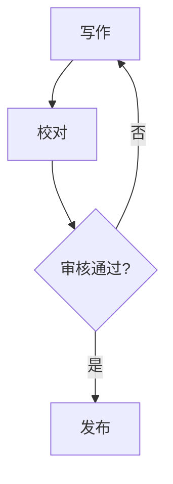

# Markdown 完全写作指南

> Markdown 是一种轻量级标记语言，创始人为 John Gruber。它允许人们"使用易读易写的纯文本格式编写文档"。本指南将带你掌握所有常用语法。

## 一、基础语法

### 1.1 标题

Markdown 支持六级标题，使用 `#` 号标记：

```markdown
# 一级标题
## 二级标题
### 三级标题
#### 四级标题
##### 五级标题
###### 六级标题
```

### 1.2 强调与样式

- **加粗**：用 `**` 包裹 → `**加粗文字**`
- *斜体*：用 `*` 包裹 → `*斜体文字*`
- ~~删除线~~：用 `~~` 包裹
- ==高亮==：用 `==` 包裹（部分编辑器支持）
- `行内代码`：用反引号包裹

### 1.3 链接与图片

**外部链接**：[Typora 官网](https://typora.io)

**图片嵌入**：

> 💡 **Tip**：在 [[Obsidian 与 Typora 协作流程]] 中，我们使用专用工具自动转换链接格式。

## 二、列表与表格

### 2.1 无序列表

- 苹果
- 香蕉
  - 海南香蕉
  - 进口香蕉
- 樱桃

### 2.2 有序列表

1. 打开编辑器
2. 编写内容
3. 导出发布

### 2.3 任务列表

- [x] 学习标题语法
- [x] 学习列表语法
- [ ] 学习表格语法
- [ ] 学习代码块

### 2.4 表格

| 语法 | 快捷键 | 说明 |
|------|--------|------|
| `**粗体**` | `⌘B` | 加粗文字 |
| `*斜体*` | `⌘I` | 斜体文字 |
| `` `代码` `` | `` ⌘` `` | 行内代码 |
| `~~删除~~` | `⌃S` | 删除线 |

## 三、代码块

### 3.1 Python 示例

```python
def fibonacci(n):
    """生成斐波那契数列"""
    a, b = 0, 1
    result = []
    for _ in range(n):
        result.append(a)
        a, b = b, a + b
    return result

# 输出前10项
print(fibonacci(10))
# → [0, 1, 1, 2, 3, 5, 8, 13, 21, 34]
```

### 3.2 JavaScript 示例

```javascript
// 防抖函数
function debounce(fn, delay = 300) {
  let timer = null;
  return function (...args) {
    clearTimeout(timer);
    timer = setTimeout(() => fn.apply(this, args), delay);
  };
}
```

### 3.3 命令行

```bash
# 安装依赖
npm install typora-evergreen-theme

# 转换 Obsidian 链接
python3 obsidian-to-typora.py input.md output.md
```

## 四、引用与分割线

### 4.1 多级引用

> 一级引用
>
> > 二级引用
> >
> > > 三级引用

### 4.2 分割线

---

## 五、进阶用法

### 5.1 脚注

Markdown 支持脚注 [^1]，适合添加补充说明。

[^1]: 脚注内容会显示在页面底部

### 5.2 数学公式（LaTeX）

行内公式：$E = mc^2$

独立公式：

$$
\int_{0}^{\infty} e^{-x^2} dx = \frac{\sqrt{\pi}}{2}
$$

### 5.3 Mermaid 图表



---

> 下一篇：[[效率工具与工作流配置]] | 相关阅读：[[项目文档规范]]
