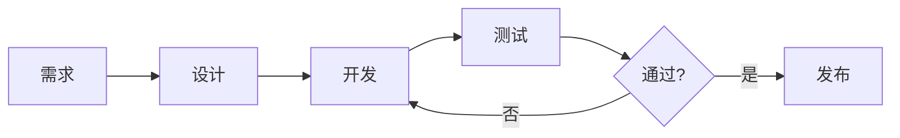
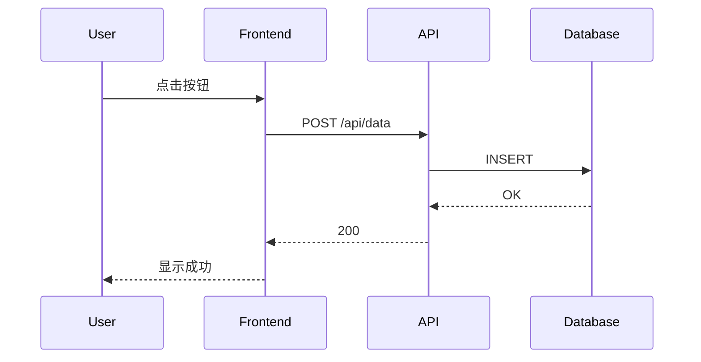

# 项目文档规范

> 好的文档是项目的说明书，也是团队的共同语言。本文整理了一套实用的文档规范，适用于各类软件项目。

## 一、文档结构

### 1.1 推荐目录树

```
docs/
├── README.md              # 项目总览
├── CHANGELOG.md           # 变更日志
├── CONTRIBUTING.md        # 贡献指南
├── guides/
│   ├── getting-started.md # 快速开始
│   ├── installation.md    # 安装部署
│   └── configuration.md   # 配置说明
├── api/
│   ├── overview.md        # API 总览
│   ├── endpoints.md       # 接口文档
│   └── errors.md          # 错误码
└── examples/
    ├── basic-usage.md     # 基础示例
    └── advanced.md        # 进阶示例
```

### 1.2 README 模板

```markdown
# 项目名称

> 一句话描述项目价值

## 特性

- 🚀 特性一
- 📦 特性二
- 🎨 特性三

## 快速开始

```bash
npm install my-project
my-project start
```

## 文档

详细文档请参阅 [效率工具与工作流配置](./效率工具与工作流配置.md)。

## 许可证

MIT
```

## 二、写作规范

### 2.1 标题层级

> 参考 [Markdown 完全写作指南 → 一基础语法](./Markdown 完全写作指南.md) 中的标题规范。

- **H1**：文档标题（每篇仅一个）
- **H2**：主要章节
- **H3**：章节子标题
- **H4**：补充说明

### 2.2 代码块标注语言

````markdown
```python
def hello():
    print("Always specify language")
```
````

✅ 正确示范：

```python
from datetime import datetime

def format_date(dt: datetime) -> str:
    """格式化日期输出"""
    return dt.strftime("%Y-%m-%d %H:%M")
```

❌ 错误示范：

```python

# 无语言的代码块 → 语法高亮缺失
def format_date(dt):
    return str(dt)
```

### 2.3 图表与示意图

Mermaid 流程图：



时序图：



## 三、模板示例

### 3.1 API 文档模板

```
# {接口名称}

## 请求

- **Method**: GET/POST/PUT/DELETE
- **URL**: `/api/v1/{resource}`
- **Headers**: `Authorization: Bearer {token}`

## 参数

| 参数名 | 类型 | 必填 | 说明 |
|--------|------|------|------|
| id | int | 是 | 资源 ID |
| name | string | 否 | 名称 |

## 响应

```json
{
  "code": 200,
  "data": { "id": 1, "name": "example" },
  "message": "success"
}
```
```

### 3.2 变更日志模板

```markdown
## [1.2.0] - 2026-06-01

### 新增
- 新增深色模式支持
- 新增批量导出功能

### 修复
- 修复表格编辑时行高跳动问题
- 修复中文字体在 Windows 下的渲染

### 变更
- 升级依赖库至 v3.x
- 优化代码块渲染性能
```

## 四、跨平台注意事项

| 差异点 | macOS | Windows |
|--------|-------|---------|
| 路径分隔符 | `/` | `\`（推荐用 `/`）|
| 换行符 | `\n` | `\r\n`（Git 自动处理）|
| 字体渲染 | Core Text | DirectWrite |
| 快捷键 | ⌘ | Ctrl |

---

> 上一篇：[效率工具与工作流配置](./效率工具与工作流配置.md) | 相关阅读：[Markdown 完全写作指南](./Markdown 完全写作指南.md)
